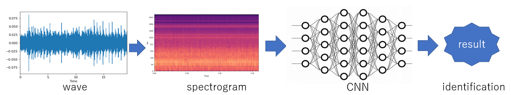

# footstep_recognition

The code is written in a lesson to recognize people's footsteps. The spectrogram of footsteps is calculated, and CNN is used to recognize the footsteps.

The model is trained on a big dataset and then applied to a smaller self-made dataset. Transfer learning and noise removal are used in the program. The code and result are for reference only because of the small size of the dataset. 

